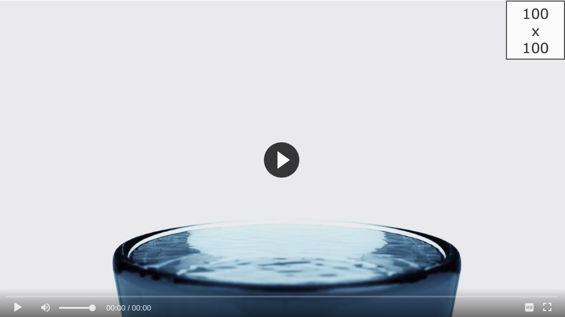
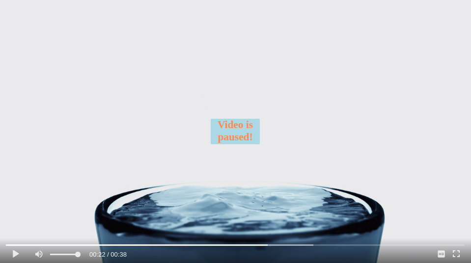

There are optional parameters that can be used to customise the Fluid Player. 
No parameters are required and will default if not passed through.
Layout controls relate to the functionality and styling of the player itself.
Vast options relate to the ads served and the how the player handles them

<br/><hr/>
# Layout Controls
The full list of _layoutControls_ are below:

```javascript
fluidPlayer(
   'my-video',
    {
        layoutControls: {
            primaryColor:           false,
            playButtonShowing:      true,
            playPauseAnimation:     true,
            fillToContainer:        false,
            autoPlay:               false,
            mute:                   false,
            keyboardControl:        true,
            layout:                 'default',
            logo: {
                imageUrl:           null,
                position:           'top left',
                clickUrl:           null,
                opacity:            1
            },
            controlBar: {
                autoHide:           true,
                autoHideTimeout:    3,
                animated:           true
            },
            timelinePreview:        {},
            htmlOnPauseBlock: {
                html:               null,
                height:             null,
                width:              null
            },
            playerInitCallback:     (function() {})
        }
    }
);
```

None of the options are required but can be tailored to better suit your own design.

## primaryColor
Primary color affects the following areas of the Fluid Player:

* Play button showing before video play (**Default:** grey)
* Play and pause animations and video toggle (**Default:** grey)
* Video played progress bar (**Default:** white)
* User defined [ad text](#adtext) (**Default:** black)

Changing this parameter will change all the above areas to the color specified.
In the below screenshot we have used the following:

```javascript
fluidPlayer(
   'my-video',
    {
        layoutControls: {
            primaryColor: "#28B8ED"
        }
    }
);
```


## playButtonShowing
By default the play button will show in the middle of the player. To hide the button this option can be set to **false**.
When this option is set to **false** the video controls will show by default.

```javascript
fluidPlayer(
   'my-video',
    {
        layoutControls: {
            playButtonShowing: false // Default true
        }
    }
);
```

## playPauseAnimation
There is a Play / Pause animation that can be disabled using this parameter. By default this parameter is set to **true**

```javascript
fluidPlayer(
    'my-video',
    {
        layoutControls: {
            playPauseAnimation: false // Default true
        }
    }
);
```


## fillToContainer
If the Fluid Player is placed into a container on your page you can use this parameter to fill to the size of that container. 
Set this parameter to **true** to set the width and height to 100%

```javascript
fluidPlayer(
    'my-video',
    {
        layoutControls: {
            fillToContainer: true // Default true
        }
    }
);
```
 
## autoPlay
By default this parameter is set to **false**. When set to **true** the video will play automatically when the page loads.

```javascript
fluidPlayer(
    'my-video',
    {
        layoutControls: {
            autoPlay: true // Default false
        }
    }
);
```
 
## mute
Set this parameter to **true** to have the video muted by default.

```javascript
fluidPlayer(
    'my-video',
    {
        layoutControls: {
            mute: true // Default false
        }
    }
);
```
 
## keyboardControl
The following key commands are usable by **Default:**

* **Space/Enter:** Pause/Play video playback
* **Left/Right arrow:** Go back/forward 5 seconds
* **Home/End:** Go to beginning/end of video
* **Numbers 0-9:** Skip to a particular section of the video (e.g., 5 goes to the video midpoint)
* **Up/Down arrow:** Increase/Decrease volume 5%
* **m key:** Mute/Unmute video volume
* **f key:** Go to Full Screen mode

If you wish to disable these options set _keyboardControl_ to **false**

```javascript
fluidPlayer(
    'my-video',
    {
        layoutControls: {
            keyboardControl: false // Default true
        }
    }
);
```

## logo
The _logo_ option allows you to show an image overlaid in the corner of the player. There are 4 options that can be set to configure this logo.

* **imageUrl:** The location of the image to show. (**Default:** null)
* **position:** Where on the player the logo will show. (**Default:** 'top left')
* **clickUrl:** If you want the logo to be a link to another page you can set the landing page with this parameter. (**Default:** null)
* **opacity:** This will toggle the opacity styling option of the logo. (**Default:** 1)

```javascript
fluidPlayer(
    'my-video',
    {
        layoutControls: {
            logo: {
                imageUrl: 'https://www.routetomylogo.com', // Default null
                position: 'top right', // Default 'top left'
                clickUrl: 'https://www.landingpage.com/welcome', // Default null
                opacity:  0.8 // Default 1
            }
        }
    }
);
```



## controlBar
The control bar will hide when the mouse is inactive after a certain amount of time. 
There are three options for this parameter:

* **autoHide:** Configure whether or not to hide the controls. (**Default:** false)
* **autoHideTimeout:** How long, in seconds, before the controls will hide. (**Default:** 3)
* **animated:** If set to false the controls disappear instantly. True be default, will mean the controls fade out. (**Default:** true)

```javascript
fluidPlayer(
    'my-video',
    {
        layoutControls: {
            controlBar: {
                autoHide: true, // Default false
                autoHideTimeout: 5, // Default 3
                animated: false // Default true
            }
        }
    }
);
```

## timelinePreview
Sets the timeline preview, visible when hovering over the progress bar. 
The provided file contains the thumbnail images used for the preview. 
The type sets the format of the file. Currently only the VTT format is supported. 
The timeline preview only works if the default layout is chosen (see above).

```javascript
fluidPlayer(
    'my-video',
    {
        layoutControls: {
            timelinePreview: {
                file: 'thumbnails.vtt',
                type: 'VTT'
            }
        }
    }
);
```


## htmlOnPauseBlock
Defined HTML to be displayed in the center of the player when the user pauses the video. Note: Clicking on the HTML area triggers a play event. 
If you don't need that behaviour then add **e.stopPropagation()** to your event. There are three options for this parameter.

* **html:** The HTML to display.
* **height:** The height of the HTML to show. An integer representation of the pixel size.
* **width:** The width of the HTML to show. An integer representation of the pixel size.

```javascript
fluidPlayer(
    'my-video',
    {
        layoutControls: {
            htmlOnPauseBlock: {
                html: '<b>Paused</b>', // Default null
                height: 50, // Default null
                width: 100 // Default null
            }
        }
    }
);
```


 
## layout
The default layout is **default**. It provides own skin to the player. 
Another option is **browser**, meaning that the standard video player layout and behaviour, specific for each browser, is used.

```javascript
fluidPlayer(
    'my-video',
    {
        layoutControls: {
            layout: 'browser' // Default 'default'
        }
    }
);
```

## playerInitCallback
This callback function can be used to execute custom code when the player in initialised.

```javascript
fluidPlayer(
    'my-video',
    {
        layoutControls: {
            playerInitCallback: (function() { console.log('player loaded!') })
        }
    }
);
```

<br/><hr/>
# Vast Options
These options are specifically for when ads are shown in the player.

```javascript
fluidPlayer(
   'my-video',
    {
        vastOptions: {
            adList:                     {},
            skipButtonCaption:          'Skip ad in [seconds]',
            skipButtonClickCaption:     'Skip ad <span class="skip_button_icon"></span>',
            adText:                      null,
            adCTAText:                   null, //Remove
            vastTimeout:                 5000,

            vastAdvanced: {
                vastLoadedCallback:       (function() {}),
                noVastVideoCallback:      (function() {}),
                vastVideoSkippedCallback: (function() {}),
                vastVideoEndedCallback:   (function() {})
            }
        }
    }
);
```

## adList
Setup one or multiple VAST tag. For each of the tags there are multiple options.

* **roll (mandatory):** The available timeline positions: _preRoll_, _midRoll_, _postRoll_, _onPauseRoll_.
* **vastTag (mandatory):** The url of the VAST XML (Please find the supported tags/attributes vastLinear.xml)
* **timer (only for mid-roll):** the timer property schedules when the ad should show. There are two ways to define this:
  - **[seconds]:** The number of seconds until the ad begins. Example: _timer: 10_
  - **[percentage]:** The percentage of the video to show before the ad begins. Example: _timer: 50%_

We can set multiple _midRoll_ VAST tags, however only one _preRoll_ and _postRoll_ can be set. See the example below:

```javascript
fluidPlayer(
   'my-video',
    {
        vastOptions: {
            adList: [
                {
                    roll: 'preRoll',
                    vastTag: 'vastPreRoll.xml'
                },
                {
                    roll: 'midRoll',
                    vastTag: 'vastMidRoll.xml',
                    timer: 8
                },
                {
                    roll: 'midRoll',
                    vastTag: 'vastMidRoll2.xml',
                    timer: 10
                },
                {
                    roll: 'postRoll',
                    vastTag: 'vastPostRoll.xml'
                }
            ]
        }
    }
);
```
                        
* **vAlign** (only for nonLinear, optional): The available vertical positions for nonLinear Ads: top, middle, bottom. Default: bottom.
* **nonLinearDuration** (only for nonLinear, optional): The number of seconds until the nonLinear Ad will be shown. If not set nor the minSuggestedDuration attribute of VAST XML than wont close until end of video.
* **size** (only for nonLinear, optional): The dimension of the Ad. Supported sizes: 468x60, 300x250, 728x90

```javascript
fluidPlayer(
   'my-video',
    {
        vastOptions: {
            adList: [
                {
                    roll: 'onPauseRoll',
                    vastTag: 'vastNonLinear.xml',
                    vAlign: 'top',
                    nonlinearDuration: 10,
                    size: '300x250'
                }
            ]
        }
    }
);
```

## skipButtonCaption
The text to display the countdown during an ad. The **[seconds]** placeholder is used for the second countdown.
(**Default:** "Skip ad in [seconds]")

```javascript
fluidPlayer(
   'my-video',
    {
        vastOptions: {
            skipButtonCaption: 'Wait [seconds] more second(s)'
        }
    }
);
```

## skipButtonClickCaption
This defines the text to show when the countdown is finished and the user can skip to the main video.
(**Default:** 'Skip ad <span class="skip_button_icon"></span>')

```javascript
fluidPlayer(
   'my-video',
    {
        vastOptions: {
            skipButtonClickCaption: 'Watch main video <span class="skip_button_icon"></span>'
        }
    }
);
```

## adText
Custom text can be shown when an in-stream ad plays. This text appears in the top left corner of the player and will be set to the primary colour.

```javascript
fluidPlayer(
   'my-video',
    {
        vastOptions: {
            adText: 'Advertising helps us keep the lights on' // Default null
        }
    }
);
```


## vastTimeout
This parameter lets you set the time, in milliseconds, to wait for the VAST to load. (**Default:** 5000)

```javascript
fluidPlayer(
   'my-video',
    {
        vastOptions: {
            vastTimeout: 1000 // Default 5000
        }
    }
);
```

## vastAdvanced
We can specify the callback functions on the different VAST events.

* **vastLoadedCallback:** When the VAST has loaded.
* **noVastVideoCallback:** When there is no VAST video.
* **vastVideoSkippedCallback:** If the ad is skipped.
* **vastVideoEndedCallback:** When the ad and ended.

```javascript
fluidPlayer(
   'my-video',
    {
        vastOptions: {
            vastAdvanced: {
                vastLoadedCallback:       (function() { console.log("Here one event") }),
                noVastVideoCallback:      (function() { console.log("Here another") }),
                vastVideoSkippedCallback: (function() { console.log("Here one more") }),
                vastVideoEndedCallback:   (function() { console.log("Here's the last") })
            }
        }
    }
);
```