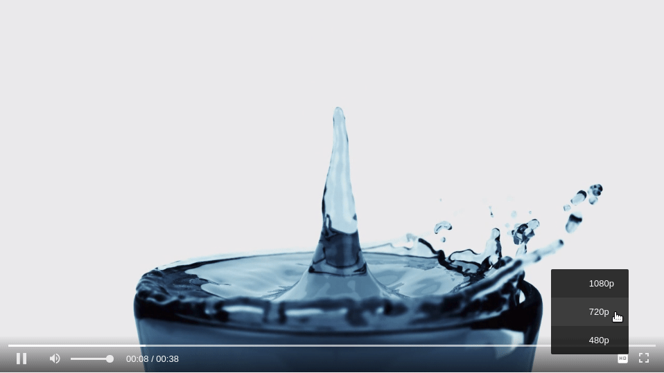

## Quick Integration
In order to set Fluid Player, three things are required:

* The Javascript and CSS files of the player;
* An HTML5 `<video>` tag;
* A single Javascript line of code that attaches the player to the video tag.

```html
<html>
   <head>
      <title>Fluid Player</title>
      <link rel="stylesheet" href="https://cdn.fluidplayer.com/v2/current/fluidplayer.min.css" type="text/css"/>
      <script src="https://cdn.fluidplayer.com/v2/current/fluidplayer.min.js"></script>
   </head>
   <body>
      <video id='my-video'>
         <source src='vid.mp4' type='video/mp4' />
      </video>
      
      <script type="text/javascript">
         fluidPlayer('my-video');
      </script>
   </body>
</html>
```

The `fluidPlayer()` function gets the video tag id as a first parameter, which is required.


### Syntax

```javascript
fluidPlayer(idVideoPlayer[, options]);
```

## Quality Switching
Multiple sources can be added as shown below. The title will be displayed to the user when switching sources

```html
<video id='my-video' controls style="width: 640px; height: 360px;">
    <source src='vid_1080p.mp4' title='1080p' type='video/mp4' />
    <source src='vid_720p.mp4' title='720p' type='video/mp4' />
    <source src='vid_480p.mp4' title='480p' type='video/mp4' />
</video>
```




## Integration Using Optional Parameters

Fluid Player can be customized by setting some optional parameters. 
The full list of parameters can be found under [Configuration](../configuration)

```html
<link rel="stylesheet" href="https://cdn.fluidplayer.com/v2/current/fluidplayer.min.css" type="text/css"/>
<script src="https://cdn.fluidplayer.com/v2/current/fluidplayer.min.js"></script>

<video id='my-video' controls style="width: 640px; height: 360px;">
    <source src='vid.mp4' type='video/mp4' />
</video>

<script type="text/javascript">
fluidPlayer(
   'my-video',
    {
        layoutControls: {
            // Parameters to customise the look and feel of the player
        },
        vastOption: {
            // Parameters to customise how the ads are displayed & behave
        }
    }
);
</script>
```